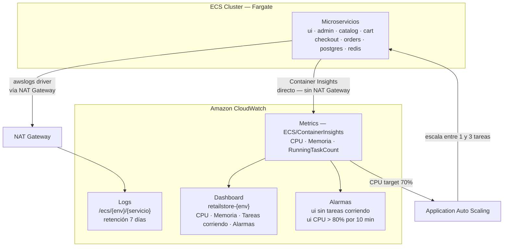
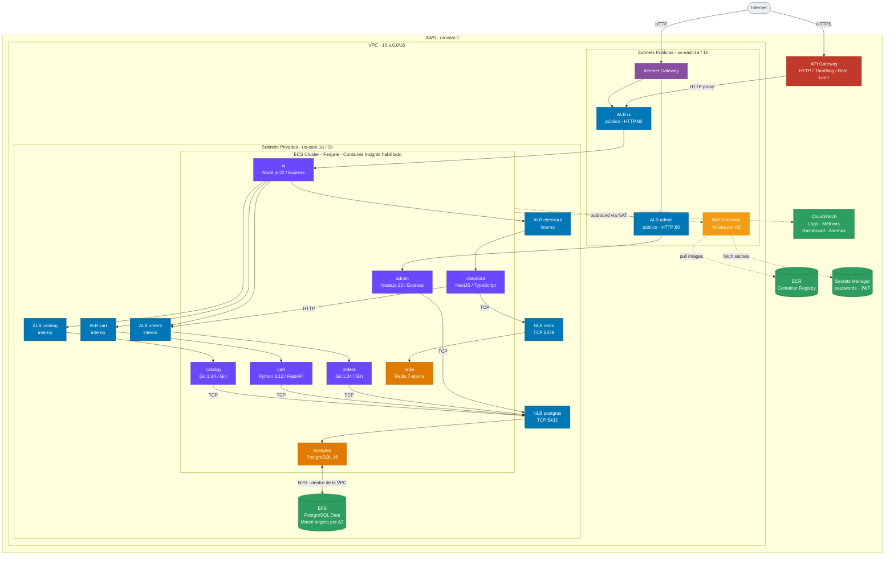
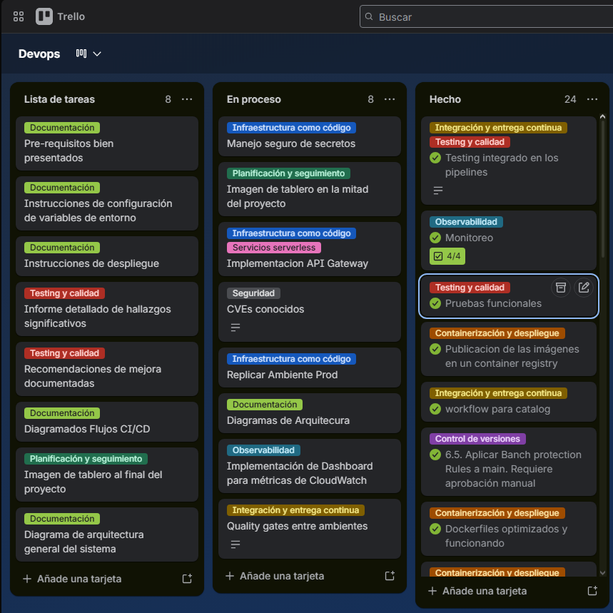
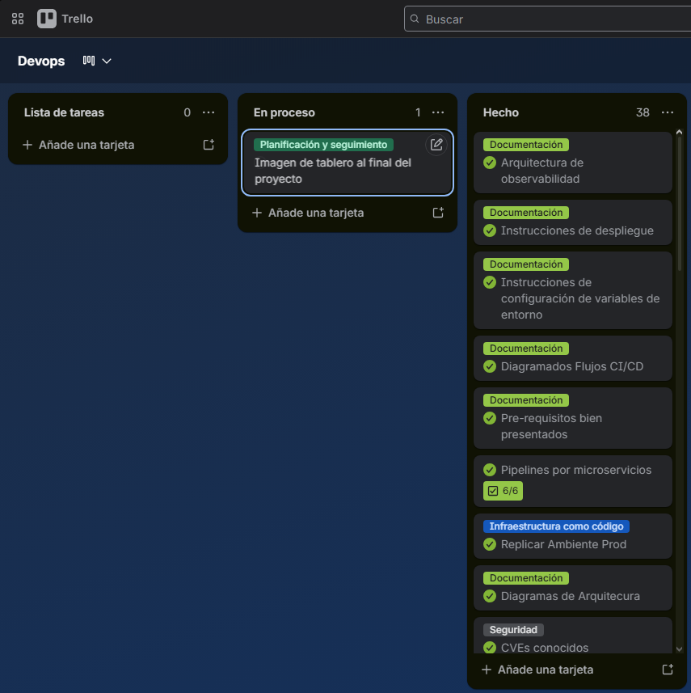

# Documentación — RetailStore DevOps

**Materia:** DevOps  
**Universidad:** ORT Uruguay

| Integrante       | Número de estudiante |
| ---------------- | -------------------- |
| Joaquín Gil      | 322300               |
| Joaquín Pardiñas | 323279               |
| Mateo González   | 323444               |

---

### Observación

En esta entrega surgió un imprevisto: el equipo encontró un error no reproducible durante el inicio del sistema al levantar los microservicios. En un principio, estos funcionan correctamente en el ambiente de desarrollo, pero al levantar los demás entornos, algunos microservicios dejan de funcionar. Tras investigar el comportamiento, descubrimos que podría existir un límite en la cantidad de contenedores o en la memoria disponible, lo que provoca que ciertos microservicios no se ejecuten o se detengan inesperadamente cuando se inician otros nuevos.

## Pre-requisitos

### Ejecución local

- [Docker](https://docs.docker.com/get-docker/) 24+
- [Docker Compose](https://docs.docker.com/compose/install/) v2.20+

### Despliegue en AWS

- [Terraform](https://developer.hashicorp.com/terraform/install) >= 1.5 con provider `hashicorp/aws ~> 5.0`
- [AWS CLI](https://aws.amazon.com/cli/) configurado con credenciales activas
- Sesión de AWS Academy Learner Lab activa (las credenciales expiran cada 4 horas)
- Acceso de escritura al repositorio de GitHub para configurar Secrets y aprobar deploys de producción

---

### Variables de entorno

#### Ejecución local

El archivo `docker-compose.yml` define valores por defecto para todas las variables. No se requiere configuración adicional para levantar el entorno local.

| Variable | Servicio | Default local |
| -------- | -------- | ------------- |
| `RETAIL_UI_ENDPOINTS_*` | ui | URLs internas de Docker Compose |
| `CART_POSTGRES_*` / `RETAIL_CATALOG_PERSISTENCE_*` | cart, catalog, orders | `db:5432` |
| `RETAIL_CHECKOUT_PERSISTENCE_REDIS_URL` | checkout | `redis://redis:6379` |
| `ADMIN_USERNAME` / `ADMIN_PASSWORD` | admin | `admin` / `admin` |
| `ADMIN_JWT_SECRET` | admin | `change-me-in-production` |

#### Despliegue en AWS — GitHub Secrets requeridos

Deben configurarse en **Settings → Secrets and variables → Actions** del repositorio antes de ejecutar cualquier pipeline.

| Secret | Usado por | Descripción |
| ------ | --------- | ----------- |
| `AWS_ACCESS_KEY_ID` | Terraform CI + CI de microservicios | Credencial de AWS Academy |
| `AWS_SECRET_ACCESS_KEY` | Terraform CI + CI de microservicios | Credencial de AWS Academy |
| `AWS_SESSION_TOKEN` | Terraform CI + CI de microservicios | Token de sesión temporal del Learner Lab |
| `DB_PASSWORD` | Terraform CI | Contraseña de PostgreSQL; se almacena en Secrets Manager |
| `ADMIN_PASSWORD` | Terraform CI | Contraseña del panel admin; se almacena en Secrets Manager |
| `ADMIN_JWT_SECRET` | Terraform CI | Secreto JWT del admin; se almacena en Secrets Manager |
| `SONAR_TOKEN` | CI de cada microservicio | Token de SonarCloud para análisis de calidad |
| `SEMGREP_APP_TOKEN` | CI de cada microservicio | Token de Semgrep para análisis SAST |

---

### Instrucciones de despliegue

#### Ejecución local

```bash
# Levantar todos los servicios
docker compose up --build

# Detener
docker compose down

# Resetear base de datos
docker compose down -v
```

| Servicio | URL |
| -------- | --- |
| Tienda | http://localhost:8080 |
| Admin | http://localhost:8081 |

#### Despliegue en AWS (primera vez)

El primer despliegue requiere crear la infraestructura y subir las imágenes iniciales a ECR antes de que el CI/CD pueda operar.

**1. Configurar los GitHub Secrets** listados en la sección anterior.

**2. Desplegar la infraestructura** ejecutando el pipeline de Terraform desde GitHub Actions (Actions → Terraform CI → Run workflow, seleccionar environment y action `apply`), o de forma local:

Antes de aplicar, crear el archivo `secrets.auto.tfvars` en el directorio del ambiente (está en `.gitignore`, no se commitea):

```hcl
# environments/dev/secrets.auto.tfvars
db_password      = "retailpassword"
admin_password   = "admin"
admin_jwt_secret = "tu-secreto-jwt"
```

```bash
cd environments/dev
terraform init
terraform apply
```

Repetir para `environments/test` y `environments/prod`.

**3. (Opcional) Subir imágenes manualmente a ECR** — solo necesario si se quiere hacer el bootstrap sin esperar al CI/CD, por ejemplo para validar la infraestructura antes de que exista algún pipeline ejecutado. Requiere Docker y AWS CLI configurados localmente:

```bash
bash scripts/push-images.sh
```

En condiciones normales este paso no es necesario: el primer push a `main` dispara el CI de cada microservicio, que construye y sube las imágenes automáticamente.

#### Flujo normal (CI/CD)

Una vez bootstrapeado el entorno, todo deploy se gestiona automáticamente al hacer push a `main`:

```
push a main
  └─► deploy automático → dev
        └─► deploy automático → test
              └─► aprobación manual en GitHub Actions → prod
```

Este flujo aplica tanto a cambios en la infraestructura (Terraform CI) como a cambios en el código de cada microservicio (CI individual por servicio).

---

## Documentación de proyecto

### Roles y responsabilidades

Joaquín Gil: Encargado de infraestructura

Joaquín Pardiñas: Encargado de documentación y testing

Mateo González: Encargado de CI/CD

---

### Herramientas seleccionadas

#### Gestión de repositorios

La herramienta utilizada fue GitHub, la cual nos permitió mantener el versionado del sistema a lo largo del desarrollo. Esta decisión se tomó debido a la experiencia previa del equipo con la plataforma, lo que facilitó su adopción con una mínima capacitación.

#### CI/CD pipelines

Dada la selección de GitHub, el equipo decidió que la opción más lógica sería implementar GitHub Actions. Al ser la herramienta de automatización integrada por defecto, nos permitió unificar la gestión del código y el despliegue en un mismo lugar.

#### Análisis de código estático (SAST)

Se utilizó SonarCloud para el análisis de código estático, ya que fue la herramienta empleada durante el curso y el equipo se sentía cómodo con ella. Si bien no contábamos con experiencia previa utilizando SonarCloud en proyectos reales, ya conocíamos su funcionamiento.

#### SCA y Escaneo de imágenes

Trivy fue la herramienta seleccionada para la detección de dependencias y el escaneo de imágenes. La utilización de esta herramienta se justificó por su uso previo en el curso y su simple implementación en nuestro workflow, además de ser una solución muy reconocida para estas tareas.

#### Detección de secretos

Después de una investigación de herramientas, el equipo concluyó que TruffleHog sería la opción que mejor se adapta a las necesidades del proyecto. Su implementación no interfería con las tecnologías ya utilizadas ni requería grandes cambios en el código, además de ser una herramienta muy confiable y segura.

#### Testing

Se decidió utilizar Newman junto con archivos de pruebas de Postman. En un principio, se intentó utilizar este último para la creación de colecciones y flujos automatizados, pero la idea fue descartada debido a las dificultades que presentó su implementación. A efectos de la entrega y por la escala del proyecto, decidimos utilizar esta alternativa que, en la práctica, nos permite obtener el mismo resultado final que esperábamos con la opción anterior.

---

### Estructura de repositorios

Para el desarrollo de este proyecto se optó por un enfoque de repositorio único, centralizando tanto el código de la aplicación como la infraestructura y las definiciones de los pipelines de CI/CD. Al tratarse de un proyecto académico con un alcance acotado y un ciclo de vida definido sin planes de continuidad a largo plazo, la separación en múltiples repositorios habría generado una sobrecarga operativa innecesaria. Un solo repositorio eliminó esta complejidad, permitiendo al equipo concentrarse estrictamente en el valor técnico de la entrega.

---

### Estrategia de ramas

Se utilizó **GitHub Flow** con una única rama permanente y ramas de vida corta:

| Rama        | Descripción                                          |
| ----------- | ---------------------------------------------------- |
| `main`      | Única rama permanente, siempre en estado desplegable |
| `feature/*` | Ramas de vida corta para nuevas funcionalidades      |
| `bugfix/*`  | Ramas de vida corta para corrección de errores       |

El flujo de trabajo es:

```
feature/* → main
bugfix/*  → main
```

Cada rama de vida corta se deriva de main, se integra mediante un Pull Request y se elimina una vez mergeada. Esta integración requiere la aprobación de revisión por parte de otro integrante para poder realizar el merge.

#### Justificación

Decidimos implementar **GitHub Flow** basándonos en nuestra experiencia previa con GitFlow en el proyecto integrador. Si bien esa metodología resultó muy útil en su momento, su estructura con múltiples ramas permanentes genera una sobrecarga innecesaria para un desarrollo de corta duración y sin continuidad a largo plazo.

Aunque inicialmente evaluamos **GitLab Flow** como alternativa, descubrimos que seguía acarreando una complejidad similar a la de GitFlow para la escala de nuestro proyecto. Por ello, consolidamos la transición hacia GitHub Flow: un enfoque que mantiene una única rama permanente (`main`) siempre en estado desplegable, de la cual se derivan ramas de vida corta para cada *feature* o *fix* que se integran mediante Pull Requests. Esto elimina la necesidad de mantener una rama de desarrollo (`develop`), reduciendo pasos intermedios sin perder el orden ni el control del flujo de trabajo.

Además, al **gestionar los ambientes mediante pipelines** en lugar de asociarlos a ramas específicas, ganamos flexibilidad para promover el código entre entornos sin depender de la estructura de ramificación, lo que se adapta mejor a la naturaleza ágil y acotada del proyecto.

---

### Ambientes

Los ambientes se gestionan íntegramente mediante **pipelines**. Todo merge a `main` dispara el pipeline, que promueve el artefacto a través de los distintos entornos:

| Ambiente | Deploy                         |
| -------- | ------------------------------ |
| Dev      | Automático                     |
| Test     | Automático (tras quality gate) |
| Prod     | Aprobación manual requerida    |

---

### Pipelines de CI/CD

#### Estructura general

Todos los pipelines de microservicios siguen una estructura uniforme de siete etapas. Los jobs de seguridad y testing corren en paralelo antes del build; los deploys a dev y test corren en paralelo entre sí; prod requiere aprobación manual a través de GitHub Environments.

```
secrets-scan ─┐
sast          ├─► build-and-push ─► deploy-dev ─┐
sca           │                    deploy-test ──┴─► deploy-prod
tests         ─┘
```

#### Decisiones transversales

**Filtrado por paths**

Cada pipeline incluye un filtro `paths:` que lo dispara únicamente cuando cambian archivos del microservicio correspondiente o el propio archivo de workflow. Esto evita ejecuciones innecesarias en el monorepo donde un cambio en `src/catalog` no debería correr el pipeline de `src/orders`.

**Acciones pinneadas por SHA**

Todas las actions de terceros están referenciadas por su SHA de commit completo en lugar de un tag mutable (e.g., `@v4`). Esto protege contra ataques de supply chain donde un tag podría ser redirigido a un commit malicioso.

**Trivy con `ignore-unfixed: true`**

Tanto en el escaneo de filesystem (SCA) como en el de imagen, Trivy filtra vulnerabilidades para las cuales no existe un fix disponible, enfocando el resultado en las que realmente pueden remediarse actualizando dependencias.

**TruffleHog con `--only-verified`**

El detector de secretos solo reporta credenciales que puede verificar activamente contra una API externa (tokens de AWS, GitHub, Stripe, etc.). Esto reduce la cobertura frente a credenciales no verificables como pares usuario/contraseña simples, pero minimiza los falsos positivos que harían inviable el pipeline en la práctica.

**Artefacto inmutable con promoción por etiquetas**

La imagen Docker se construye una única vez en `build-and-push`, etiquetada con el SHA del commit. En cada deploy posterior se re-etiqueta (`:dev`, `:test`, `:prod`) sin reconstruir, garantizando que el artefacto que llega a producción es exactamente el mismo que fue escaneado y testeado.

**Build solo en push, no en pull requests**

El job `build-and-push` tiene la condición `if: github.event_name != 'pull_request'`. En PRs se ejecutan los jobs de seguridad y testing para dar feedback, pero no se construye ni despliega imagen alguna, evitando pushes a ECR desde ramas no mergeadas.

---

#### Pipeline: Catalog (`ci-catalog.yml`)

**Testing sin base de datos**

El servicio arranca con `RETAIL_CATALOG_PERSISTENCE_PROVIDER: in-memory`, lo que elimina la necesidad de PostgreSQL en CI. Este modo está implementado en el microservicio y permite validar toda la API sin dependencias externas.

**Build de Go**

Se usa `CGO_ENABLED=1` para la compilación, requerido por dependencias que incluyen código C. La versión de Go se obtiene del archivo `go.mod` del proyecto, garantizando consistencia entre desarrollo y CI.

---

#### Pipeline: Orders (`ci-orders.yml`)

**Dependencia de PostgreSQL real en tests**

A diferencia de catalog, orders no implementa un provider in-memory y requiere una instancia real de PostgreSQL. Se resuelve con un service container de GitHub Actions (`postgres:16-alpine`) que arranca junto al job.

**Credenciales hardcodeadas en CI**

Las credenciales del PostgreSQL de testing (`retail_user` / `retail_pass`) están hardcodeadas en el workflow. Esto es aceptable porque son exclusivas del entorno efímero de CI, el contenedor vive solo durante el job y no es accesible desde fuera del runner, y no se reusan en ningún ambiente productivo.

---

#### Pipeline: Cart (`ci-cart.yml`)

**Testing sin base de datos**

El servicio arranca con `CART_PERSISTENCE_PROVIDER: in-memory`, eliminando la necesidad de PostgreSQL en CI, al igual que catalog.

**Runtime Python**

Cart es un microservicio Python/FastAPI que se inicia directamente con `uvicorn` sin paso de compilación previo. Las dependencias se instalan con `pip install -r requirements.txt`.

---

#### Pipeline: Checkout (`ci-checkout.yml`)

**Yarn 4 Berry**

El proyecto checkout usa Yarn 4 (Berry) con Plug'n'Play. En lugar de invocar el comando global `yarn`, el pipeline llama directamente al binario del repositorio: `node .yarn/releases/yarn-4.11.0.cjs`. Esto garantiza que se usa exactamente la versión de Yarn definida en el proyecto, independientemente de lo instalado en el runner.

**Excepción Trivy (imagen): `src/checkout/.trivyignore`**

Trivy detectó `CVE-2026-12151` (HIGH) en `undici`, una librería HTTP bundleada dentro del binario de `npm` que viene incluido en la imagen base de Node.js (`/usr/local/lib/node_modules/npm`). La vulnerabilidad es un DoS a través de WebSockets.

Se decidió suprimir esta CVE porque:
- El `npm` interno de la imagen nunca se ejecuta en producción; el contenedor arranca directamente con `node dist/main.js`
- Al no ejecutarse `npm`, el código vulnerable de `undici` nunca es alcanzable
- El fix existe en `undici` 6.27.0 pero aún no está incluido en ninguna release de Node.js

El archivo debe ser removido cuando Node.js publique una versión que incluya `undici` ≥ 6.27.0.

---

#### Pipeline: UI (`ci-ui.yml`)

**Sin dependencias externas en tests**

El microservicio UI puede arrancar y responder al health check sin conectarse a ningún backend, lo que simplifica los tests de integración al no requerir servicios adicionales.

**Excepción Trivy (imagen): `src/ui/.trivyignore`**

Trivy detectó `CVE-2026-12151` (HIGH) en `undici`, bundleado dentro de `npm` en la imagen base de Node.js. La misma situación que checkout y admin: el `npm` interno nunca se ejecuta en producción (el contenedor arranca con `node dist/app.js`), por lo que el código vulnerable no es alcanzable. El archivo debe removerse cuando Node.js incluya `undici` ≥ 6.27.0.

---

#### Pipeline: Admin (`ci-admin.yml`)

**Gestión de credenciales**

El microservicio admin implementa autenticación propia con usuario/contraseña y JWT. En CI las credenciales se manejan así:

- `ADMIN_USERNAME`: hardcodeado como `admin` en el workflow (valor de testing conocido y sin impacto en producción)
- `ADMIN_PASSWORD`: tomado del GitHub Secret `ADMIN_PASSWORD`
- `ADMIN_JWT_SECRET`: tomado del GitHub Secret `ADMIN_JWT_SECRET`

**Paso de credenciales a Newman**

Para evitar la interpolación directa del secret en el script de shell, el secret se expone primero como variable de entorno del step y luego se pasa a Newman mediante `--env-var`:

```yaml
env:
  ADMIN_PASSWORD: ${{ secrets.ADMIN_PASSWORD }}
run: |
  newman run ... --env-var "adminPassword=$ADMIN_PASSWORD"
```

La colección de Newman usa `{{adminPassword}}` en el body del request de login, que Newman resuelve con el valor pasado por `--env-var`. Este patrón evita riesgos de inyección de shell que existirían si el secret se interpolara directamente en el comando.

**Sincronización de credenciales en producción**

Las credenciales del admin en ECS provienen de AWS Secrets Manager, cuyo valor es gestionado por Terraform vía el GitHub Secret `ADMIN_PASSWORD`. Si el secret se actualiza, es necesario: (1) re-aplicar Terraform para actualizar Secrets Manager, y (2) forzar un nuevo deployment de ECS para que los contenedores lean el nuevo valor. Actualizar solo el GitHub Secret no es suficiente.

**Excepción Trivy (imagen): `src/admin/.trivyignore`**

Trivy detectó `CVE-2026-12151` (HIGH) en `undici`, bundleado dentro de `npm` en la imagen base de Node.js. La misma situación que checkout y ui: el `npm` interno nunca se ejecuta en producción (el contenedor arranca con `node dist/app.js`), por lo que el código vulnerable no es alcanzable. El archivo debe removerse cuando Node.js incluya `undici` ≥ 6.27.0.

---

#### Pipeline: DB (`ci-db.yml`)

El pipeline de DB gestiona la imagen de inicialización de PostgreSQL que carga el esquema SQL al arrancar. A diferencia del resto, no corresponde a un microservicio de aplicación.

**Imagen base**

Se usa `postgres:18-alpine3.23`. Se evaluó inicialmente `postgres:16-alpine` y se migró a la versión 18 buscando resolver las vulnerabilidades detectadas por Trivy (ver hallazgo de `gosu` más abajo).

**Hallazgo: CVEs en `gosu`**

Trivy detectó 14 vulnerabilidades (1 CRITICAL, 13 HIGH) en el binario `gosu`, incluido en la imagen oficial de postgres. `gosu` es una utilidad compilada con Go v1.24.6 que los mantenedores de la imagen usan para el cambio de usuario `root → postgres` al arrancar el servidor. La investigación determinó que:

- Las mismas CVEs están presentes en `postgres:16-alpine` y `postgres:18-alpine3.23`: ambas incluyen la misma versión de `gosu`
- Las vulnerabilidades son de tipo TLS/crypto DoS y afectan a un binario que no expone funcionalidad TLS ni realiza conexiones de red, por lo que la superficie de ataque real es mínima en este contexto
- No es posible actualizar `gosu` sin recompilar la imagen base completa; depende de que los mantenedores de Alpine actualicen el paquete

**Excepción: `src/db/.trivyignore`**

Se creó el archivo `.trivyignore` con las 14 CVEs explícitamente listadas y documentadas. El archivo incluye la justificación técnica y debe ser removido cuando Alpine actualice el paquete `gosu` a una versión compilada con Go ≥ 1.24.13 o ≥ 1.25.7.

**Validación de SQL**

El job `validate-sql` levanta un servicio PostgreSQL real y ejecuta el script de inicialización `src/db/init-db.sql` contra él, verificando que el SQL es válido y que las bases de datos y tablas se crean correctamente. La contraseña de este contenedor de test se obtiene del secret `DB_PASSWORD`.

**Sin SAST ni SonarCloud**

El pipeline de DB no incluye análisis de código estático ni SonarCloud, ya que no hay código de aplicación que analizar; el único artefacto es un script SQL y una imagen de infraestructura.

---

### Arquitectura de observabilidad

La observabilidad del sistema se centraliza en **Amazon CloudWatch** y cubre tres flujos: logs, métricas y auto-scaling reactivo. No se implementa trazado distribuido en producción (el soporte OpenTelemetry de catalog está deshabilitado al no configurarse `OTEL_SERVICE_NAME` en el entorno).



---

### Decisiones de arquitectura

#### Diagrama de arquitectura general

La infraestructura corre íntegramente en **AWS (us-east-1)** sobre **ECS Fargate**. El tráfico de usuarios llega vía HTTPS a **API Gateway** (que aplica throttling) y de ahí al ALB público de la UI. El panel **Admin** se accede directamente por HTTP a través del **Internet Gateway** a su ALB público. Todos los microservicios y bases de datos corren en **subnets privadas** sin IP pública: los backends se exponen internamente via ALBs internos y las bases de datos via NLBs internos. Las tareas en subnets privadas usan los **NAT Gateways** (uno por AZ) para acceder a ECR, Secrets Manager y CloudWatch. **EFS** vive dentro de la VPC con mount targets en cada subnet privada; el tráfico NFS entre PostgreSQL y EFS nunca sale de la red.



#### Decisiones de diseño

**ECS Fargate como plataforma de cómputo unificada**

Para toda la capa de cómputo —incluyendo PostgreSQL y Redis— optamos por ECS Fargate en lugar de EC2. Esta decisión eliminó la necesidad de gestionar sistemas operativos, parches y capacidad de servidores, y nos permitió unificar aplicaciones y bases de datos bajo el mismo primitivo de despliegue (task definition). La consecuencia directa es que Fargate no provee almacenamiento local persistente, lo que obligó a resolver la persistencia de PostgreSQL de otra forma.

**Persistencia de PostgreSQL con Amazon EFS**

Como Fargate no ofrece almacenamiento de bloque persistente, elegimos Amazon EFS para mantener los datos de PostgreSQL entre reinicios y reemplazos de tareas. Configuramos mount targets en cada subnet privada —una por zona de disponibilidad— para garantizar que la tarea puede arrancar en cualquier AZ sin perder datos. La latencia de EFS es mayor que la de EBS, pero es aceptable para la carga de este proyecto; en un entorno de producción de alta demanda, la alternativa natural sería migrar a RDS.

**Repositorios ECR compartidos y promoción de artefactos**

Los tres ambientes comparten los mismos repositorios ECR, creados una sola vez en dev. Las imágenes se construyen una única vez con el SHA del commit y se re-etiquetan conforme avanzan: `:sha` → `:dev` → `:test` → `:prod`. Esto garantiza que el artefacto que llega a producción es exactamente el mismo que fue testeado, eliminando variaciones por re-builds. Cada ambiente tiene su propia VPC con rangos CIDR no superpuestos y su propio estado Terraform en S3.

**Infraestructura modularizada con Terraform**

Toda la infraestructura está organizada en módulos Terraform. Los módulos `networking`, `ecs`, `ecs_service`, `database`, `redis` y `apigateway` son instanciados por los tres ambientes con parámetros distintos —CIDR de VPC, nombre de cluster, imágenes— lo que garantiza consistencia entre entornos y concentra los cambios en un único lugar. El módulo `ecs_service` es el más reutilizado: se instancia seis veces por ambiente (una por microservicio), evitando duplicar un patrón que incluye security groups, ALB, target group, listener, log group, ECS service y auto-scaling. El módulo `ecr` es un caso aparte: se instancia únicamente en dev, que es quien crea los repositorios de imágenes. Test y prod no lo usan — referencian esos mismos repositorios mediante `data "aws_ecr_repository"`, lo que refleja que ECR es un recurso compartido entre ambientes y no uno propio de cada entorno.

**API Gateway únicamente para el frontend**

Implementamos HTTP API Gateway exclusivamente frente al servicio UI para aplicar throttling (1.000 req/s, burst de 2.000) y exponer un endpoint HTTPS al usuario final. No lo colocamos frente a los backends internos porque agregaría latencia en cada llamada sin beneficio real: esos servicios solo son accesibles dentro de la VPC. La integración es `HTTP_PROXY` hacia el ALB de la UI con rutas `ANY /` y `ANY /{proxy+}` que cubren todas las rutas sin configuración adicional.

---

### Gestión del proyecto

Para la gestión de tareas y la organización del equipo, se implementó un tablero Kanban mediante la herramienta Trello. Este tablero se mantuvo actualizado de forma continua durante todo el ciclo de vida del proyecto, funcionando como un eje central para la visualización del flujo de trabajo. Las tareas se categorizaron dinámicamente en tres estados principales: Lista de tareas (To Do), En proceso (In Progress) y Hecho (Done), permitiendo un seguimiento en tiempo real del avance de cada requerimiento. Se seleccionó esta herramienta debido a su flexibilidad, lo cual facilitó la adaptación de la metodología a las necesidades específicas del equipo y permitió gestionar el cambio de manera ágil a través de la adición, modificación o eliminación de tareas a medida que el proyecto evolucionaba.

#### Tablero Kanban

Capturas de pantalla en distintas etapas mostrando la evolución del tablero Kanban utilizado a lo largo del desarrollo del proyecto.

##### Inicio


##### Mitad



##### Cierre


