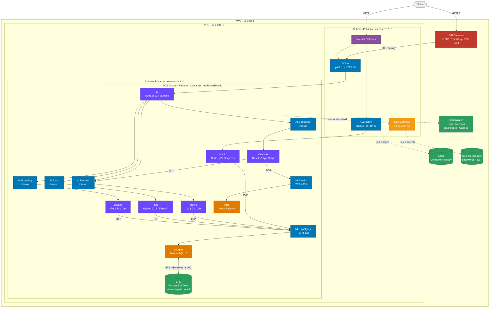
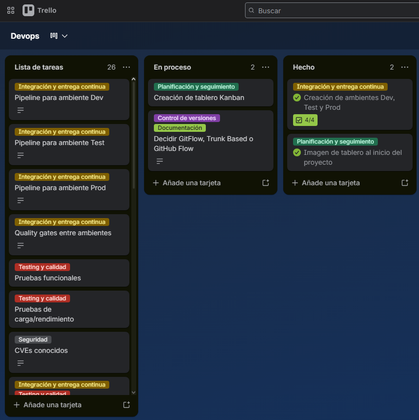

# Documentación — RetailStore DevOps

**Materia:** DevOps  
**Universidad:** ORT Uruguay

| Integrante       | Número de estudiante |
| ---------------- | -------------------- |
| Joaquín Gil      | 322300               |
| Joaquín Pardiñas | 323279               |
| Mateo González   | 323444               |

---

## Pre-requisitos

### Variables de entorno

### Instrucciones de despliegue

---

## Documentación de proyecto

### Roles y responsabilidades

Joaquín Gil: Encargado de infraestructura

Joaquín Pardiñas: Encargado de documentación y testing

Mateo González: Encargado de CI/CD

---

### Herramientas seleccionadas

#### Gestión de repositorios

La herramienta utilizada fue GitHub, la cual nos permitió mantener el versionado del sistema a lo largo del desarrollo. Esta decisión se tomó debido a la experiencia previa del equipo con la plataforma, lo que facilitó su adopción con una mínima capacitación.

#### CI/CD pipelines

Dada la selección de GitHub, el equipo decidió que la opción más lógica sería implementar GitHub Actions. Al ser la herramienta de automatización integrada por defecto, nos permitió unificar la gestión del código y el despliegue en un mismo lugar.

#### Análisis de código estático (SAST)

Se utilizó SonarQube para el análisis de código estático, ya que fue la herramienta empleada durante el curso y el equipo se sentía cómodo con ella. Si bien no contábamos con experiencia previa utilizando SonarQube en proyectos reales, ya conocíamos su funcionamiento.

#### SCA y Escaneo de imágenes

Trivy fue la herramienta seleccionada para la detección de dependencias y el escaneo de imágenes. La utilización de esta herramienta se justificó por su uso previo en el curso y su simple implementación en nuestro workflow, además de ser una solución muy reconocida para estas tareas.

#### Detección de secretos

Después de una investigación de herramientas, el equipo concluyó que TruffleHog sería la opción que mejor se adapta a las necesidades del proyecto. Su implementación no interfería con las tecnologías ya utilizadas ni requería grandes cambios en el código, además de ser una herramienta muy confiable y segura.

#### Testing

Se decidió utilizar Newman junto con archivos de pruebas de Postman. En un principio, se intentó utilizar este último para la creación de colecciones y flujos automatizados, pero la idea fue descartada debido a las dificultades que presentó su implementación. A efectos de la entrega y por la escala del proyecto, decidimos utilizar esta alternativa que, en la práctica, nos permite obtener el mismo resultado final que esperábamos con la opción anterior.

---

### Estructura de repositorios

Para el desarrollo de este proyecto se optó por un enfoque de repositorio único, centralizando tanto el código de la aplicación como la infraestructura y las definiciones de los pipelines de CI/CD. Al tratarse de un proyecto académico con un alcance acotado y un ciclo de vida definido sin planes de continuidad a largo plazo, la separación en múltiples repositorios habría generado una sobrecarga operativa innecesaria. Un solo repositorio eliminó esta complejidad, permitiendo al equipo concentrarse estrictamente en el valor técnico de la entrega.

---

### Estrategia de ramas

Se utilizó **GitHub Flow** con una única rama permanente y ramas de vida corta:

| Rama        | Descripción                                          |
| ----------- | ---------------------------------------------------- |
| `main`      | Única rama permanente, siempre en estado desplegable |
| `feature/*` | Ramas de vida corta para nuevas funcionalidades      |
| `bugfix/*`  | Ramas de vida corta para corrección de errores       |

El flujo de trabajo es:

```
feature/* → main
bugfix/*  → main
```

Cada rama de vida corta se deriva de main, se integra mediante un Pull Request y se elimina una vez mergeada. Esta integración requiere la aprobación de revisión por parte de otro integrante para poder realizar el merge.

#### Justificación

Decidimos implementar **GitHub Flow** basándonos en nuestra experiencia previa con GitFlow en el proyecto integrador. Si bien esa metodología resultó muy útil en su momento, su estructura con múltiples ramas permanentes genera una sobrecarga innecesaria para un desarrollo de corta duración y sin continuidad a largo plazo.

Por este motivo, optamos por GitHub Flow: un enfoque que mantiene una **única rama permanente (`main`) siempre en estado desplegable**, de la cual se derivan ramas de vida corta para cada feature o bugfix que se integran mediante Pull Requests. Esto reduce los pasos intermedios y elimina la necesidad de mantener una rama de integración (`develop`), conservando igualmente el orden y el control del flujo de trabajo.

Además, al **gestionar los ambientes mediante pipelines** en lugar de asociarlos a ramas específicas, ganamos flexibilidad para promover el código entre entornos sin depender de la estructura de ramificación, lo que se adapta mejor a la naturaleza ágil y acotada del proyecto.

---

### Ambientes

Los ambientes se gestionan íntegramente mediante **pipelines**. Todo merge a `main` dispara el pipeline, que promueve el artefacto a través de los distintos entornos:

| Ambiente | Deploy                         |
| -------- | ------------------------------ |
| Dev      | Automático                     |
| Test     | Automático (tras quality gate) |
| Prod     | Aprobación manual requerida    |

---

### Decisiones de arquitectura

#### Diagrama de arquitectura general

La infraestructura corre íntegramente en **AWS (us-east-1)** sobre **ECS Fargate**. El tráfico de usuarios llega vía HTTPS a **API Gateway** (que aplica throttling) y de ahí al ALB público de la UI. El panel **Admin** se accede directamente por HTTP a través del **Internet Gateway** a su ALB público. Todos los microservicios y bases de datos corren en **subnets privadas** sin IP pública: los backends se exponen internamente via ALBs internos y las bases de datos via NLBs internos. Las tareas en subnets privadas usan los **NAT Gateways** (uno por AZ) para acceder a ECR, Secrets Manager y CloudWatch. **EFS** vive dentro de la VPC con mount targets en cada subnet privada; el tráfico NFS entre PostgreSQL y EFS nunca sale de la red.



#### Decisiones de diseño

**ECS Fargate como plataforma de cómputo unificada**

Para toda la capa de cómputo —incluyendo PostgreSQL y Redis— optamos por ECS Fargate en lugar de EC2. Esta decisión eliminó la necesidad de gestionar sistemas operativos, parches y capacidad de servidores, y nos permitió unificar aplicaciones y bases de datos bajo el mismo primitivo de despliegue (task definition). La consecuencia directa es que Fargate no provee almacenamiento local persistente, lo que obligó a resolver la persistencia de PostgreSQL de otra forma.

**Persistencia de PostgreSQL con Amazon EFS**

Como Fargate no ofrece almacenamiento de bloque persistente, elegimos Amazon EFS para mantener los datos de PostgreSQL entre reinicios y reemplazos de tareas. Configuramos mount targets en cada subnet privada —una por zona de disponibilidad— para garantizar que la tarea puede arrancar en cualquier AZ sin perder datos. La latencia de EFS es mayor que la de EBS, pero es aceptable para la carga de este proyecto; en un entorno de producción de alta demanda, la alternativa natural sería migrar a RDS.

**Repositorios ECR compartidos y promoción de artefactos**

Los tres ambientes comparten los mismos repositorios ECR, creados una sola vez en dev. Las imágenes se construyen una única vez con el SHA del commit y se re-etiquetan conforme avanzan: `:sha` → `:dev` → `:test` → `:prod`. Esto garantiza que el artefacto que llega a producción es exactamente el mismo que fue testeado, eliminando variaciones por re-builds. Cada ambiente tiene su propia VPC con rangos CIDR no superpuestos y su propio estado Terraform en S3.

**Infraestructura modularizada con Terraform**

Toda la infraestructura está organizada en módulos Terraform. Los módulos `networking`, `ecs`, `ecs_service`, `database`, `redis` y `apigateway` son instanciados por los tres ambientes con parámetros distintos —CIDR de VPC, nombre de cluster, imágenes— lo que garantiza consistencia entre entornos y concentra los cambios en un único lugar. El módulo `ecs_service` es el más reutilizado: se instancia seis veces por ambiente (una por microservicio), evitando duplicar un patrón que incluye security groups, ALB, target group, listener, log group, ECS service y auto-scaling. El módulo `ecr` es un caso aparte: se instancia únicamente en dev, que es quien crea los repositorios de imágenes. Test y prod no lo usan — referencian esos mismos repositorios mediante `data "aws_ecr_repository"`, lo que refleja que ECR es un recurso compartido entre ambientes y no uno propio de cada entorno.

**API Gateway únicamente para el frontend**

Implementamos HTTP API Gateway exclusivamente frente al servicio UI para aplicar throttling (1.000 req/s, burst de 2.000) y exponer un endpoint HTTPS al usuario final. No lo colocamos frente a los backends internos porque agregaría latencia en cada llamada sin beneficio real: esos servicios solo son accesibles dentro de la VPC. La integración es `HTTP_PROXY` hacia el ALB de la UI con rutas `ANY /` y `ANY /{proxy+}` que cubren todas las rutas sin configuración adicional.

---

### Gestión del proyecto

#### Tablero Kanban

##### Inicio



##### Mitad

_Pendiente_

##### Cierre

_Pendiente_
